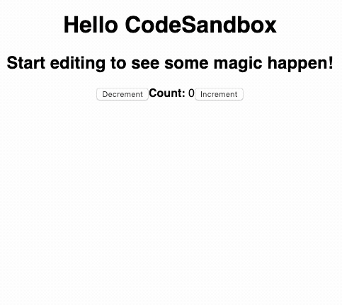

# `useGlobalState(key, initialValue = "")`



A custom React hook for shared state. Typescript ready, isomorphic, and tiny. No dependencies (apart from React, obviously), and fully tested.

## Install

```bash
npm install --save @baublet/use-global-state
```

## Use

`const [value, setState] = useGlobalState(key, initialValue = "")`

All hooks with the same `key` will share state and update together.

```tsx
import * as React from "react";
import * as ReactDOM from "react-dom";
import { useGlobalState } from ".";

function App() {
  return (
    <div>
      <h1>Use Global State</h1>
      <ChildComponent />
      <ChildComponent />
      <ChildComponent />
    </div>
  );
}

// Each of these components will share state with one another
const ChildComponent = () => {
  const [count, setCount] = useGlobalState("count", 0);
  return (
    <>
      <hr />
      <button onClick={() => setCount(count - 1)} data-testid="dec">
        -
      </button>
      &nbsp;
      <div data-testid="count">{count}</div>
      &nbsp;
      <button onClick={() => setCount(count + 1)} data-testid="inc">
        +
      </button>
    </>
  );
};

const rootElement = document.getElementById("root");
ReactDOM.render(<App />, rootElement);
```
